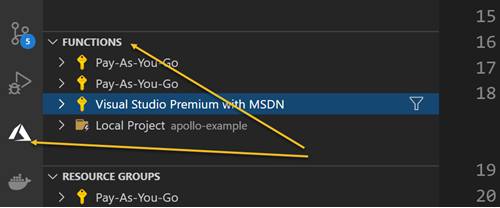

This is the working repo for this Azure-functions page found [here](https://www.apollographql.com/docs/apollo-server/deployment/azure-functions/)

After cloning this repo, type in 

```
npm initialize
func host start
```
 
You should see this:


Congratulations, you just saved a lot of time.


**Auto Deployment**

Because you cloned this project you already have a function app folder and a function inside the folder named graphql. The easiest way to deploy is using the Azure tool set auto-deployment option.



**Manual Deployment**
This is the [part where things get tricky, go slow and make sure they all work.](https://www.apollographql.com/docs/apollo-server/deployment/azure-functions/#setting-up-resources-in-azure-for-deployment) 


- az group create --name apollo-examples --location centralus   <input type="checkbox" checked />

- az storage account create \
    --name apolloexample \
    --location eastus \
    --resource-group apollo-examples \
    --sku Standard_LRS <input type="checkbox" checked /> 
  
- az functionapp create \
    --resource-group apollo-examples \
    --name apollo-example \
    --consumption-plan-location eastus \
    --runtime node \
    --storage-account apolloexample <input type="checkbox" checked /> 


**Deploy**

Note you must already be in a Function App folder first, it should look like this:


With the function.json as:
```json
{
  "disabled": false,
  "bindings": [
    {
      "authLevel": "function",
      "type": "httpTrigger",
      "direction": "in",
      "name": "req",
      "methods": [
        "get",
        "post"
      ]
    },
    {
      "type": "http",
      "direction": "out",
      "name": "$return"
    }
  ]
}
```

And the index.js
```jsx
const { ApolloServer, gql } = require("apollo-server-azure-functions");

// Construct a schema, using GraphQL schema language
const typeDefs = gql`
  type Query {
    hello: String
  }
`;

// Provide resolver functions for your schema fields
const resolvers = {
  Query: {
    hello: () => "Hello world!",
  },
};

const server = new ApolloServer({ typeDefs, resolvers });

exports.graphqlHandler = server.createHandler();

```

Package.json dependencies:

```json
 "dependencies": {
    "apollo-server-azure-functions": "^2.21.0",
    "graphql": "^15.5.0"
  }
```

Host.json
```json
{
  "version": "2.0",
  "extensions": {
    "http": {
        "routePrefix": ""
    }
  }
}
```
To use the new function open up the [portal](https://portal.zaure.com).
Then drill down to the function just uploaded select "GetFunction key";

 chose "default(Function key)"

**The Playground**
The playground should show and this query should return data...


**But how does our application use this function?**

We're not sure, but here's what we've learned.

- When the request happens it's a post
- The body must contain the query

The outbound query looks like this:


But the get url looks like this:


Note the queryString for code? That's required and is a key.

**CORS**
We also know we'll need to deal with CORS if we are not same origin.

 

 